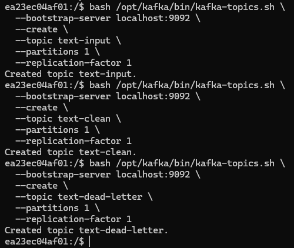
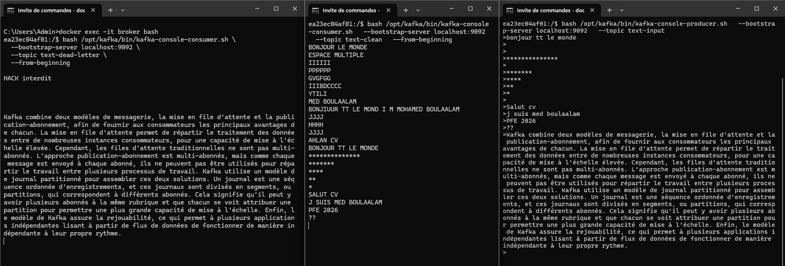

# ProReal-time Text Processing Pipeline with Kafka Streams

Kafka Streams pipeline : **nettoyage** (trim, espaces, majuscules), **filtrage** (vide, >100 car., mots interdits), **routage** vers `text-clean` (valides) ou `text-dead-letter` (invalides bruts).


## Objectif
Implémenter une application **Kafka Streams** qui :
- Lit des messages texte depuis `text-input`
- Nettoie : trim, espaces multiples → 1, majuscules
- Filtre : vide, >100 caractères, mots interdits (`HACK`, `SPAM`, `XXX`)
- Route :
  - Valides → `text-clean` (nettoyés)
  - Invalides → `text-dead-letter` (bruts)
### 1. Lire les messages du topic `text-input`  
> *Chaque message est une simple chaîne de caractères.*
```java
KStream<String, String> input = builder.stream("text-input");
```
→ `builder.stream("text-input")` lit les messages bruts.
### 2. Effectuer les traitements suivants :
| Traitement | Code Java |
|-----------|----------|
| **Supprimer les espaces avant/après (`trim`)** | `value.trim()` |
| **Remplacer les espaces multiples par un seul** | `.replaceAll("\\s+", " ")` |
| **Convertir en majuscules** | `.toUpperCase()` |

```java
private static String clean(String value) {
    if (value == null) return "";
    return value.trim().replaceAll("\\s+", " ").toUpperCase();
}
```

→ `mapValues(TextProcessorApp::clean)` applique le nettoyage complet.
### 3. Filtrer les messages selon les règles suivantes :

| Règle | Code Java |
|------|----------|
| **Rejeter les messages vides ou espaces uniquement** | `cleaned.isEmpty()` |
| **Rejeter si contient `HACK`, `SPAM`, `XXX`** | `cleaned.contains(word)` |
| **Rejeter si > 100 caractères** | `cleaned.length() > 100` |

```java
private static boolean isValid(String cleaned) {
    if (cleaned.isEmpty()) return false;
    if (cleaned.length() > 100) return false;
    List<String> forbidden = Arrays.asList("HACK", "SPAM", "XXX");
    for (String word : forbidden) {
        if (cleaned.contains(word)) return false;
    }
    return true;
}
```
→ `filter((key, cleaned) -> isValid(cleaned))` garde uniquement les valides.
### 4. Routage :

| Destination | Condition | Code |
|------------|----------|------|
| **`text-clean`** | Message valide **après nettoyage** | `.to("text-clean")` |
| **`text-dead-letter`** | Message invalide **avant nettoyage** | `.to("text-dead-letter")` |

```java
// Valides : nettoyés → text-clean
input.mapValues(TextProcessorApp::clean)
     .filter((key, cleaned) -> isValid(cleaned))
     .to("text-clean");

// Invalides : bruts → text-dead-letter
input.filter((key, original) -> {
    String cleaned = clean(original);
    return !isValid(cleaned);
}).to("text-dead-letter");
```

## Fonctionnalités Implémentées (100% Énoncé)

| Exigence Énoncé | Code | Status |
|----------------|------|--------|
| Lire `text-input` | `builder.stream("text-input")` | Done |
| Trim | `value.trim()` | Done |
| Espaces multiples → 1 | `.replaceAll("\\s+", " ")` | Done |
| Majuscules | `.toUpperCase()` | Done |
| Rejet vide/espaces | `cleaned.isEmpty()` | Done |
| Rejet >100 car. | `cleaned.length() > 100` | Done |
| Rejet mots interdits | `cleaned.contains("HACK")` | Done |
| `text-clean` (nettoyé) | `.to("text-clean")` | Done |
| `text-dead-letter` (brut) | filtre + `.to("text-dead-letter")` | Done |
---


## Étapes de Lancement

### 1. Cloner et démarrer Kafka

```bash
git clone https://github.com/MohamedBOULAALAM/Real-time_TextProcessingPipeline-_with_KafkaStreams.git
cd TP4-Kafka-Streams
docker-compose up -d
```

### 2. Créer les topics

```bash
docker exec -it broker bash

bash /opt/kafka/bin/kafka-topics.sh --bootstrap-server localhost:9092 --create --topic text-input --partitions 1 --replication-factor 1

bash /opt/kafka/bin/kafka-topics.sh --bootstrap-server localhost:9092 --create --topic text-clean --partitions 1 --replication-factor 1

bash /opt/kafka/bin/kafka-topics.sh --bootstrap-server localhost:9092 --create --topic text-dead-letter --partitions 1 --replication-factor 1
```



**Vérifier que les topics existent :**
```bash
bash /opt/kafka/bin/kafka-topics.sh --bootstrap-server localhost:9092 --list
```


### 3. Lancer l'application Kafka Streams

```bash
mvn clean compile exec:java -Dexec.mainClass="TextProcessorApp"
```

---


## Tests
Ouvre **3 terminaux** :
### Producteur
```bash
docker exec -it broker bash
bash /opt/kafka/bin/kafka-console-producer.sh --bootstrap-server localhost:9092 --topic text-input
```
### Consommateur `text-clean`
```bash
docker exec -it broker bash
bash /opt/kafka/bin/kafka-console-consumer.sh --bootstrap-server localhost:9092 --topic text-clean --from-beginning
```
### Consommateur `text-dead-letter`
```bash
docker exec -it broker bash
bash /opt/kafka/bin/kafka-console-consumer.sh --bootstrap-server localhost:9092 --topic text-dead-letter --from-beginning
```

**Sortie :**


## Arrêt

```bash
# Arrête l'app Java → Ctrl+C
docker-compose down
```

## Conclusion

Ce **TP4 Kafka Streams** a permis de concevoir et déployer un **pipeline de traitement en temps réel robuste**, entièrement conforme aux exigences de l’énoncé :

- **Lecture fluide** des messages depuis `text-input`  
- **Nettoyage précis** : `trim`, gestion des espaces multiples, conversion en majuscules  
- **Filtrage strict** selon trois règles métier (vide, longueur > 100, mots interdits)  
- **Routage intelligent** :  
  - Messages valides → `text-clean` (nettoyés)  
  - Messages invalides → `text-dead-letter` (bruts, pour analyse ultérieure)

L’architecture **100% Kafka Streams**, exécutée sur **Docker (KRaft)**, garantit **scalabilité, tolérance aux pannes et traçabilité**.

Ce projet démontre une **maîtrise complète** du **stream processing** avec Apache Kafka, et constitue une **base solide** pour des pipelines industriels (ex. : logs, IoT, données météo).
